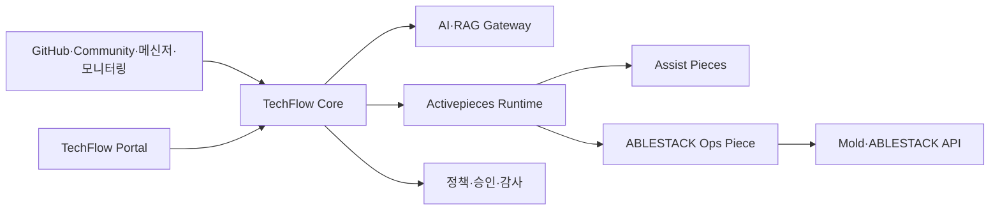

# ABLESTACK TechFlow

## Issues #66-#68 Community 지속 대화와 해결 상태

Community Assist는 질문 한 건에 한 번 답하고 종료하지 않습니다. 질문자가 후속 댓글과 이미지, 로그 또는 로그 압축 파일을 추가하면 같은 Case의 대화 맥락으로 다시 분석하고, 담당자가 Community에서 전체 답변을 검토·승인합니다. 질문자가 Best Answer로 해결 표시를 할 때까지 맥락을 유지하며, 해결 표시가 해제되면 같은 Case를 다시 엽니다.

사용자 답변은 별도 제목 없이 `증상`부터 시작하고, 적용 버전은 `ABLESTACK Diplo`, `ABLESTACK Europa`로 표시합니다. Citation·Repository·Commit 등 내부 근거는 사용자 본문에 노출하지 않습니다.

- [지속 대화·해결 상태 설계](docs/plans/issues-66-68-community-conversation-design.md)
- [배포·운영 Runbook](docs/runbooks/community-conversation.md)
- [구현·E2E 검증 보고서](docs/reports/issues-66-68-community-conversation-validation.md)
- [완료 보고서 PDF](output/pdf/techflow-community-conversation-report.pdf)
- [검토 프레젠테이션 PDF](output/pdf/techflow-community-conversation-presentation.pdf)
- [검토 프레젠테이션 PPTX](output/presentation/techflow-community-conversation.pptx)

## Issue #64 Community 원문 승인형 AI 답변

Chat 길이 제한으로 전체 AI 답변을 검토할 수 없던 문제를 해결했습니다. 별도 일반 계정 `TechFlow-Assistant`가 Community에 전체 답변을 `승인 대기 중`으로 등록하고, Chat은 담당자에게 원문 검토 링크만 전달합니다. 관리자는 질문·답변·이미지·로그 압축 분석 내용을 Community에서 확인한 뒤 Flarum Approval로 공개를 결정합니다.

답변은 ABLESTACK 문서, Diplo 현재 코드와 관련 제품 코드, Europa 미출시 Preview, 공식 libvirt/QEMU/KVM 자료 순서로 종합 검토합니다. 사용자는 근거 경로나 Citation 없이 `증상·원인·해결 방법·추가 고려사항·적용 버전` 형식의 쉬운 답변만 보며, 내부 근거는 담당자가 `근거 <Case ID>`를 명시할 때만 확인합니다.

- [Community 원문 승인형 AI 답변 설계](docs/plans/issue-64-answer-clarity-community-review-design.md)
- [배포·운영 Runbook](docs/runbooks/community-ai-review-post.md)
- [구현·E2E 완료 보고서](docs/reports/issue-64-answer-clarity-validation.md)
- [완료 보고서 PDF](output/pdf/techflow-issue-64-answer-clarity-report.pdf)
- [승인용 프레젠테이션 PDF](output/pdf/techflow-issue-64-answer-clarity-presentation.pdf)
- [승인용 프레젠테이션 PPTX](output/presentation/techflow-issue-64-answer-clarity.pptx)

## Issue #22 Chat 기반 Community 승인

Community AI 답변 검토를 Synology Chat의 `TechFlowAssist` Bot으로 일원화합니다. 담당자는 신규 글이 등록되면 선제 알림을 받고, `상세`에서 질문과 답변만 확인해 승인·수정 승인·반려할 수 있습니다. 내부 근거가 필요할 때만 `근거 <Case>`를 명시하며, 처리 이력과 대기 목록도 같은 대화에서 조회합니다. Activepieces는 승인·게시 순서를 실행하고 AI Gateway가 Bot 인증, Reviewer 권한, Draft Version, 상태·멱등성·감사를 강제합니다.

일반 Chat 기술 질문과 Community 답변은 공개 문서·Diplo 현재 출시 코드·Wall·Cockpit·Genie·Kickstart·QEMU 도구를 종합 검토합니다. Europa는 미출시 프리뷰로만 비교하며, 현재 동작의 근거로 혼합하지 않습니다. 저장소·브랜치·커밋·파일·라인은 내부 승인 담당자에게만 Evidence Ledger로 제공하고 일반 사용자 답변에서는 제거합니다.

- [Chat 기반 Community 승인 설계](docs/plans/issue-22-chat-community-approval-design.md)
- [Chat 기반 Community 승인 운영 Runbook](docs/runbooks/chat-community-approval.md)
- [Diplo 현재판·Europa 프리뷰 안전 답변 설계](docs/plans/issues-62-63-versioned-safe-answer-design.md)
- [Versioned Safe Answer 운영 Runbook](docs/runbooks/versioned-safe-answer.md)
- [Issue #62·#63 구현·검증 보고서](docs/reports/issues-62-63-versioned-safe-answer-validation.md)
- [Versioned Safe Answer 보고서 PDF](output/pdf/techflow-versioned-safe-answer-report.pdf)
- [Versioned Safe Answer 발표자료 PDF](output/pdf/techflow-versioned-safe-answer-presentation.pdf)
- [Versioned Safe Answer 발표자료 PPTX](output/presentation/techflow-versioned-safe-answer.pptx)
- [구현·검증 보고서](docs/reports/issue-22-chat-community-approval-validation.md)
- [보고서 PDF](output/pdf/techflow-chat-community-approval-report.pdf)
- [발표자료 PDF](output/pdf/techflow-chat-community-approval-presentation.pdf)
- [발표자료 PPTX](output/presentation/techflow-chat-community-approval.pptx)

## Issue #21 Community 질문 답변·승인

Flarum Community의 새 ABLESTACK 질문을 수집해 문서·소스코드·이미지·로그 근거 기반 초안을 만들고, 담당자가 현재 Draft Version을 승인한 경우에만 `AI-Assistant` 계정으로 게시합니다. Activepieces는 질문 수집·승인·게시 순서를 실행하고 AI Gateway가 상태·멱등성·감사와 승인 강제를 소유합니다.

- [Community Assist 설계](docs/plans/issue-21-community-assist-design.md)
- [Community Assist 운영 Runbook](docs/runbooks/community-assist.md)

## Issues #56~#58 종합·멀티모달·로그 Assist

TechFlow AI Gateway 0.8.0은 ABLESTACK 질문을 영역별로 계획하고, 승인된 Compatibility Set으로 여러 저장소의 문서·소스코드를 결합하며, PNG/JPEG/WebP 화면과 일반·ZIP·GZIP·TAR.GZ 로그를 함께 분석해 관찰·진단·권장 조치·미확인 사항을 분리한 기술지원 보고서를 생성합니다. 압축 로그는 경로 탈출·압축 폭탄·중첩 압축을 차단하고 비밀정보를 마스킹한 오류 주변 구간만 AI에 전달합니다. Cloud 브랜치나 호환성 범위가 불명확하면 생성 전에 추가 정보를 요청합니다.

- [종합·멀티모달 설계](docs/plans/issues-56-58-assist-multimodal-design.md)
- [배포·운영 Runbook](docs/runbooks/assist-multimodal.md)
- [완료 보고서](docs/reports/issues-56-58-assist-multimodal-validation.md)
- [보고서 PDF](output/pdf/techflow-assist-multimodal-report.pdf)
- [발표자료 PDF](output/pdf/techflow-assist-multimodal-presentation.pdf)
- [발표자료 PPTX](output/presentation/techflow-assist-multimodal.pptx)

## Issue #46 RAG Golden Set·보안·품질·E2E 자산화

TechFlow AI Gateway 0.6.0과 Event Gateway 0.4.0으로 승인된 7개 저장소·9개 Source Profile을 고정 Commit에서 색인하고, 70개 Golden Question의 품질·격리·보류·삭제·Activepieces E2E를 검증합니다. Test-only·Prompt Injection·Secret·Allowlist 밖 Source도 명시적 보류 사례로 검증합니다. Activepieces는 Orchestration만 담당하고 승인·등급·Compatibility·삭제·평가 정책은 TechFlow AI Gateway가 판정합니다.

Issue #46 평가 결과는 시험 질문·기대 답변·실제 답변·Citation·자동 판정·Codex 검토 판정을 함께 보존해 제품 책임자가 사례별로 확인할 수 있습니다. 운영 DB와 Activepieces에는 원문 질문·답변을 저장하지 않으며, 승인된 D0 평가 산출물에만 검토용 Q&A를 남깁니다.

- [Issue #46 Golden Set·품질·보안·E2E 완료 보고서](docs/reports/issue-46-golden-set-quality-security-e2e-validation.md)
- [Golden Set·품질·보안·E2E 배포·운영 Runbook](docs/runbooks/golden-set-quality-security-e2e.md)
- [Golden Set 평가 결정 기록](docs/decisions/techflow-golden-evaluation.json)
- [완료 보고서 PDF](output/pdf/techflow-golden-set-quality-security-e2e-report.pdf)
- [발표자료 PDF](output/pdf/techflow-golden-set-quality-security-e2e-presentation.pdf)
- [발표자료 PPTX](output/presentation/techflow-golden-set-quality-security-e2e.pptx)

## Issue #45 Activepieces 수집·재색인·평가 연동

TechFlow AI Gateway 0.5.0과 Event Gateway 0.3.0을 Activepieces의 5개 시각적 Flow에 연결했습니다. GitHub Push로 Source 후보를 감지하고, Reviewer 승인, 고정 Commit 수집·색인, Compatibility 승인, 철회·삭제, 평가를 Correlation ID로 추적합니다.

- [Issue #45 구현·검증 완료 보고서](docs/reports/issue-45-activepieces-rag-orchestration-validation.md)
- [Activepieces RAG Orchestration 배포·운영 Runbook](docs/runbooks/activepieces-rag-orchestration.md)
- [Activepieces RAG Orchestration 결정 기록](docs/decisions/techflow-activepieces-rag-orchestration.json)
- [완료 보고서 PDF](output/pdf/techflow-activepieces-rag-orchestration-report.pdf)
- [발표자료 PDF](output/pdf/techflow-activepieces-rag-orchestration-presentation.pdf)
- [발표자료 PPTX](output/presentation/techflow-activepieces-rag-orchestration.pptx)

## Issue #44 OpenAI Responses·근거 답변 구현

TechFlow AI Gateway 0.4.0은 로컬 Hybrid Retrieval 결과를 OpenAI Responses API와 결합해 근거 답변·보류·실패 상태를 구현했습니다. 단일 Repository·Commit은 `gpt-5.6-terra/medium`, 승인된 복수 구성요소는 `gpt-5.6-sol/high`로 결정론적으로 라우팅하며, strict JSON Schema와 Citation 사후 검증을 적용합니다. 시험 서버의 실 호출은 Citation 5개의 `ANSWERED`, 근거 없는 범위는 Provider 생성 호출 없는 `ABSTAINED`를 반환했고 v0.3.0 롤백과 v0.4.0 복귀까지 통과했습니다.

- [Issue #44 구현·검증 완료 보고서](docs/reports/issue-44-grounded-responses-validation.md)
- [근거 기반 Responses 배포·운영 Runbook](docs/runbooks/grounded-responses.md)
- [근거 기반 Responses 구조화 결정](docs/decisions/techflow-grounded-responses.json)
- [완료 보고서 PDF](output/pdf/techflow-grounded-responses-report.pdf)
- [발표자료 PDF](output/pdf/techflow-grounded-responses-presentation.pdf)
- [발표자료 PPTX](output/presentation/techflow-grounded-responses.pptx)

## Issue #43 Parser·Embedding·검색 구현

TechFlow AI Gateway 0.3.0은 승인된 소스의 Parser·Chunk·Embedding·Hybrid Retrieval과 파생 데이터 삭제를 구현했습니다. 최초 실증 대상인 `GENIE_MASTER`의 34개 파일을 `master@3e3c5c364f5c7261b07d49fcbcd4f3605b91f3b1`에서 인덱싱해 64개 Chunk와 Embedding을 활성화했고, 검색 결과는 Repository·Branch·Commit·Path·Line·Symbol 근거를 반환합니다. 이후 실 OpenAI Embedding으로 전체 색인을 전환하고 Issue #44의 Responses 답변 경로에 사용했습니다.

- [Issue #43 구현·검증 완료 보고서](docs/reports/issue-43-parser-embedding-validation.md)
- [Parser·Embedding·검색 배포·운영 Runbook](docs/runbooks/parser-embedding-retrieval.md)
- [Parser·Embedding·검색 구현 결정](docs/decisions/techflow-parser-embedding-retrieval.json)
- [완료 보고서 PDF](output/pdf/techflow-parser-embedding-report.pdf)
- [발표자료 PDF](output/pdf/techflow-parser-embedding-presentation.pdf)
- [발표자료 PPTX](output/presentation/techflow-parser-embedding.pptx)

ABLESTACK TechFlow는 **ABLESTACK 기술지원과 인프라 운영을 연결하는 AI 기반 시각적 자동화 플랫폼**입니다.

Activepieces를 워크플로우 실행 엔진으로 사용하고, ABLESTACK 전용 연동, 기술지원 지식, AI 정책, 승인·권한·감사 및 안전한 운영 자동화를 제품 기능으로 개발합니다.

> 현재 상태: 제품 기반, 사내 실증 실행 환경, 외부 HTTPS·서명 Webhook Ingress, 상태 백업·격리 복구, 관측성·이미지 잠금, GitHub Chat 자동화와 AI Gateway API·DB 기반 구축 완료

## 프로젝트 목표

TechFlow는 처음부터 범용 업무 자동화 제품을 만들지 않습니다. ABLESTACK 제품과 실제 사내 기술지원 업무에서 가치를 검증한 후 단계적으로 범용 플랫폼으로 확장합니다.

```text
ABLESTACK Assist
    ↓
조회·진단 Ops
    ↓
승인 기반 작업 자동화
    ↓
정책 기반 AIOps
    ↓
고객용 ABLESTACK 제품
    ↓
Domain Pack 기반 범용 TechFlow Platform
```

전체 단계와 종료 기준은 [TechFlow 제품화 및 범용 확장 계획](docs/plans/techflow-product-roadmap.md)을 참고하십시오.

## 핵심 기능

### TechFlow Assist

ABLESTACK 기술지원 담당자의 판단과 응답을 지원합니다.

- GitHub PR·Issue·릴리스 정보와 내부 업무 연계
- Community 질문 수집과 AI 답변 초안
- 사내·고객 메신저 기술 질문 응답
- 공식 문서, Known Issue 및 장애 사례 검색
- 근거·확신도 표시와 담당자 승인
- 미해결 질문의 기술지원 티켓 이관

### TechFlow Ops

ABLESTACK 환경의 조회, 진단과 실제 운영 작업을 자동화합니다.

- Zone·Cluster·Host·VM·Storage·Network 조회
- Alert·Event 분석과 장애 타임라인 구성
- 진단정보와 기술지원 번들 자동 수집
- 승인 기반 VM·서비스 운영 작업
- 검증된 Runbook 실행
- 제한된 장애 유형의 정책 기반 AIOps

Assist와 Ops는 별도 제품이 아니라 하나의 TechFlow 플랫폼을 구성하는 두 기능 축입니다. Assist에서 축적한 질문과 장애 사례는 Ops의 진단 지식이 되고, Ops의 환경 상태와 조치 결과는 Assist 답변의 근거가 됩니다.

## 제품 구조



| 구성요소 | 책임 |
|---|---|
| TechFlow Portal·Control API | 사용자, 고객, 정책, 승인, 템플릿과 실행 관리 |
| AI·RAG Gateway | 지식 검색, 답변·진단, 모델·비용·품질 관리 |
| Activepieces Runtime | 시각적 플로우 설계, Webhook, 스케줄, 실행과 재시도 |
| TechFlow Custom Pieces | GitHub, Community, 메신저 및 ABLESTACK 연동 |
| Mold·ABLESTACK API | 실제 가상자원의 권한, 상태와 작업 수행 |

Activepieces는 실행 엔진으로 사용하며 TechFlow의 제품 정책과 ABLESTACK 핵심 업무 규칙은 별도 계층에 둡니다. 초기에는 Activepieces 전체 소스를 포크하지 않고 고정된 배포 이미지와 Custom Piece를 중심으로 확장합니다.

책임·상태·멱등성·실패 경계와 실행 명령 규칙은 [ADR-0001: TechFlow와 Activepieces 책임 경계](docs/adr/0001-techflow-activepieces-responsibility-boundary.md)를 구현 기준으로 사용합니다.

Secret 저장·주입·교체·폐기와 사고 대응은 [ADR-0002: TechFlow 비밀정보 수명주기](docs/adr/0002-techflow-secret-lifecycle.md)를 구현 기준으로 사용합니다.

PostgreSQL·Redis 백업, 격리 복구, RPO·RTO와 Secret 복구 분리는 [ADR-0003: TechFlow 상태 백업과 복구 기준](docs/adr/0003-techflow-state-backup-recovery.md)을 구현 기준으로 사용합니다.

## 단계별 로드맵

| 단계 | 목표 |
|---|---|
| 0. 제품 기반 확정 | 아키텍처, Community 실행 기반, 보안과 배포 기준 확정 |
| 1. 사내 Assist 실증 | GitHub, Community, 사내 메신저 자동화 실사용 |
| 2. ABLESTACK Assist MVP | 고객 기술지원에 적용 가능한 AI Assist |
| 3. Ops Observe | 읽기 전용 자원 조회, 이벤트 분석과 진단 자동화 |
| 4. Ops Act | 승인 기반의 제한된 자원 작업 자동화 |
| 5. ABLESTACK Beta·GA | 설치·업그레이드·백업·지원 가능한 고객 제품 |
| 6. 정책 기반 AIOps | 검증된 장애 유형의 탐지·진단·조치·검증 |
| 7. 범용 플랫폼 확장 | Domain Pack과 Integration SDK 기반 범용 제품 |

단계는 일정만으로 전환하지 않습니다. 실행 성공률, AI 답변 품질, 권한·감사, 복구 가능성과 고객 배포 품질을 충족해야 다음 단계로 진행합니다.

## 첫 번째 사내 실증

1. GitHub PR Merge Webhook을 이용한 알림·문서·릴리스 업무 연계
2. Community 질문의 수집·지식 검색·AI 답변 초안·담당자 승인
3. 사내 메신저 기술 질문의 근거 기반 응답과 담당자 이관

초기 AI 답변은 자동으로 외부에 게시하지 않으며, 담당자 승인과 수정 이력을 품질 평가 데이터로 사용합니다.

## 배포 방향

- 사내 실증: 단일 Ubuntu 서버와 Docker Compose
- 고객 Beta: 고객별 전용 인스턴스
- 확장 구성: App·Worker 분리와 Kubernetes·Helm
- 폐쇄망 고객: 오프라인 설치·업그레이드 패키지 검토

현재 테스트 서버는 기능 실증 목적으로만 사용합니다.

Activepieces Compose 기준선은 테스트 서버에 배포되어 Health, Worker Polling, 데이터 영속성과 서버 재부팅 복구 검증을 통과했습니다. `techflow.ablecloud.io`에는 호스트 한정 HTTPS 전환과 엄격한 Origin TLS, HMAC 서명·Timestamp·중복 방지를 적용한 Webhook Ingress가 구성되었습니다. PostgreSQL·Redis는 매일 백업되며 운영 Volume을 변경하지 않는 격리 복구와 40초 RTO 실증을 통과했습니다. 재현 가능한 절차는 [Activepieces Compose 배포 Runbook](docs/runbooks/activepieces-compose-deployment.md), [HTTPS·Webhook Ingress 운영 Runbook](docs/runbooks/https-webhook-ingress.md)과 [상태 백업·복구 Runbook](docs/runbooks/state-backup-recovery.md)에서 관리합니다.

현재 여섯 Compose 서비스는 `image-lock.json`의 검토된 버전과 불변 이미지 식별자로 고정됩니다. 외부 이미지는 Tag+Registry Digest, 자체 Event Gateway는 M1 테스트 서버에서 승인한 로컬 Image ID를 사용하며, 배포 전 상태 백업과 무빌드 배포·롤백을 강제합니다. 동일 잠금 반복 배포, 직전 Runtime Lock 롤백, 목표 릴리스 복귀와 영속 Volume 보존 드릴을 통과했습니다. 운영 절차는 [이미지 버전 업그레이드·롤백 Runbook](docs/runbooks/image-version-upgrade-rollback.md)을 따릅니다.

P0 보안 기준은 인터넷 이벤트, Activepieces 실행면, 상태 저장소, AI/RAG와 향후 ABLESTACK 작업 경계를 위협 모델로 관리합니다. 데이터는 D0 Public부터 D3 Restricted까지 분류하고, 원문 Webhook·인증 Header와 Secret은 영속 저장하지 않으며, P1 RAG는 D0만 기본 허용합니다. Source 철회 시 Chunk·Embedding·Cache 삭제 SLO는 최대 7일입니다.

Issue #20에서는 사내 Assist 실증의 첫 AI 기반으로 문서·소스코드 RAG PoC를 상세 설계했습니다. Source는 `ablestack-docs`와 `ablestack-cloud`, `ablestack-wall`, `ablestack-cockpit-plugin`, `ablestack-genie`, `ablestack-kickstart`, `ablestack-qemu-exec-tools`를 포함합니다. Cloud는 최신 `main`·`ablestack-diplo`·`ablestack-europa` Head를 각각 후보로 추적하고 승인 Commit을 독립 색인합니다. 총 9개 Source Profile을 분리하며, 서로 다른 저장소의 근거는 승인된 Compatibility Set에서만 결합합니다. 코드 답변에는 Repository·Branch·Commit·Path·Line·Symbol Citation을 요구합니다. Activepieces는 변경 감지·승인·재색인·평가를 오케스트레이션하고 TechFlow AI Gateway가 Registry, 코드 검역·구문 분석, 검색, 답변·보류와 삭제 정책을 소유합니다. AI Gateway는 OpenAI Responses API를 제품 답변 런타임으로, Embeddings API를 Vector 생성에 사용합니다. 기본 답변은 `gpt-5.6-terra/medium`, 복잡도 규칙을 통과한 질의만 `gpt-5.6-sol/high`로 승격하며, 원본 저장소를 OpenAI File·Vector Store에 업로드하지 않습니다. ChatGPT Work와 Codex는 운영·개발 보조 도구일 뿐 제품 런타임 의존성이 아닙니다.

Issue #42에서 AI Gateway를 19개 API·19개 RAG Table로 확장하고 7개 저장소·9개 Source Profile의 최신 Head를 시험 서버의 7개 영속 Bare Mirror에 동기화했습니다. 실제 갱신은 6시간 Reconciler가 수행하고, 검역은 GitHub에 접속하지 않고 보호된 로컬 Commit을 읽습니다. 1TB로 확장된 시험 서버 Root는 ext4 1,005 GiB·가용 950 GiB이며, 7개 Mirror는 Gateway 재시작과 네트워크 없는 `GENIE_MASTER` 34개 파일 스캔을 통과했습니다. 실제 Source 승인·활성화·OpenAI 호출은 수행하지 않았습니다. Push 즉시 갱신은 #45, Parser·Chunk·Embeddings·Hybrid Retrieval·삭제 전파는 #43에서 구현합니다.

## 문서

- [제품화 및 범용 확장 계획](docs/plans/techflow-product-roadmap.md)
- [ADR-0006: TechFlow 보안 위협 모델](docs/adr/0006-techflow-security-threat-model.md)
- [ADR-0007: TechFlow 데이터 분류·보존·삭제 정책](docs/adr/0007-techflow-data-classification-retention.md)
- [보안 위협·데이터 수명주기 운영 Runbook](docs/runbooks/security-data-governance.md)
- [Issue #39 보안·데이터 정책 완료 보고서](docs/reports/issue-39-security-data-policy-validation.md)
- [보안·데이터 정책 보고서 PDF](output/pdf/techflow-security-data-policy-report.pdf)
- [보안·데이터 정책 프레젠테이션 PDF](output/pdf/techflow-security-data-policy-presentation.pdf)
- [보안·데이터 정책 프레젠테이션 PPTX](output/presentation/techflow-security-data-policy.pptx)
- [ADR-0008: TechFlow RAG PoC 아키텍처](docs/adr/0008-techflow-rag-poc-architecture.md)
- [ADR-0009: OpenAI 런타임 통합 및 모델 라우팅](docs/adr/0009-openai-runtime-integration.md)
- [Issue #20 RAG PoC 상세 설계](docs/plans/issue-20-rag-poc-design.md)
- [RAG PoC 구조화 계약](docs/decisions/techflow-rag-poc-contract.json)
- [RAG PoC 개발·검증 Runbook](docs/runbooks/rag-poc-development.md)
- [Issue #20 RAG PoC 설계 검토 보고서](docs/reports/issue-20-rag-poc-design-review.md)
- [RAG PoC 설계 보고서 PDF](output/pdf/techflow-rag-poc-design-report.pdf)
- [RAG PoC 설계 프레젠테이션 PDF](output/pdf/techflow-rag-poc-design-presentation.pdf)
- [RAG PoC 설계 프레젠테이션 PPTX](output/presentation/techflow-rag-poc-design.pptx)
- [Issue #41 AI Gateway API·DB 기반 완료 보고서](docs/reports/issue-41-ai-gateway-foundation-validation.md)
- [AI Gateway 기반 구조화 결정](docs/decisions/techflow-ai-gateway-foundation.json)
- [AI Gateway 배포·검증·롤백 Runbook](docs/runbooks/ai-gateway-foundation.md)
- [AI Gateway 기반 완료 보고서 PDF](output/pdf/techflow-ai-gateway-foundation-report.pdf)
- [AI Gateway 기반 발표자료 PDF](output/pdf/techflow-ai-gateway-foundation-presentation.pdf)
- [AI Gateway 기반 발표자료 PPTX](output/presentation/techflow-ai-gateway-foundation.pptx)
- [Issue #42 Source Registry·검역·승인 완료 보고서](docs/reports/issue-42-source-registry-validation.md)
- [Source Registry 구조화 결정](docs/decisions/techflow-source-registry.json)
- [Source Registry·검역·승인 운영 Runbook](docs/runbooks/source-registry-quarantine.md)
- [Source Registry 완료 보고서 PDF](output/pdf/techflow-source-registry-report.pdf)
- [Source Registry 발표자료 PDF](output/pdf/techflow-source-registry-presentation.pdf)
- [Source Registry 발표자료 PPTX](output/presentation/techflow-source-registry.pptx)
- [ADR-0001: TechFlow와 Activepieces 책임 경계](docs/adr/0001-techflow-activepieces-responsibility-boundary.md)
- [책임 경계 ADR 보고서 PDF](output/pdf/techflow-responsibility-boundary-report.pdf)
- [책임 경계 ADR 프레젠테이션 PDF](output/pdf/techflow-responsibility-boundary-presentation.pdf)
- [Activepieces 기능·라이선스 의사결정](docs/decisions/activepieces-license-feature-matrix.md)
- [Activepieces 라이선스 검토 보고서 PDF](output/pdf/activepieces-license-review-report.pdf)
- [Activepieces 라이선스 검토 프레젠테이션 PDF](output/pdf/activepieces-license-review-presentation.pdf)
- [GitHub Issue 기반 작업 관리](docs/governance/github-issue-management.md)
- [Activepieces 테스트 서버](docs/environments/activepieces-test-server.md)
- [Activepieces Compose 배포 Runbook](docs/runbooks/activepieces-compose-deployment.md)
- [Activepieces Compose 배포 검증 보고서](docs/reports/issue-13-activepieces-compose-deployment-validation.md)
- [Activepieces Compose 배포 보고서 PDF](output/pdf/activepieces-compose-deployment-report.pdf)
- [Activepieces Compose 배포 프레젠테이션 PDF](output/pdf/activepieces-compose-deployment-presentation.pdf)
- [HTTPS·Webhook Ingress 운영 Runbook](docs/runbooks/https-webhook-ingress.md)
- [HTTPS·Webhook Ingress 완료 보고서](docs/reports/issue-14-https-webhook-validation.md)
- [HTTPS·Webhook Ingress 보고서 PDF](output/pdf/https-webhook-ingress-report.pdf)
- [HTTPS·Webhook Ingress 프레젠테이션 PDF](output/pdf/https-webhook-ingress-presentation.pdf)
- [HTTPS·Webhook Ingress 프레젠테이션 PPTX](output/presentation/https-webhook-ingress.pptx)
- [ADR-0002: TechFlow 비밀정보 수명주기](docs/adr/0002-techflow-secret-lifecycle.md)
- [Secret 수명주기 Runbook](docs/runbooks/secret-lifecycle.md)
- [Issue #15 비밀정보 관리 완료 보고서](docs/reports/issue-15-secret-management-validation.md)
- [Secret 관리 보고서 PDF](output/pdf/techflow-secret-management-report.pdf)
- [Secret 관리 프레젠테이션 PDF](output/pdf/techflow-secret-management-presentation.pdf)
- [Secret 관리 프레젠테이션 PPTX](output/presentation/techflow-secret-management.pptx)
- [ADR-0003: TechFlow 상태 백업과 복구 기준](docs/adr/0003-techflow-state-backup-recovery.md)
- [상태 백업·복구 Runbook](docs/runbooks/state-backup-recovery.md)
- [Issue #16 백업·복구 완료 보고서](docs/reports/issue-16-backup-recovery-validation.md)
- [백업·복구 보고서 PDF](output/pdf/techflow-backup-recovery-report.pdf)
- [백업·복구 프레젠테이션 PDF](output/pdf/techflow-backup-recovery-presentation.pdf)
- [백업·복구 프레젠테이션 PPTX](output/presentation/techflow-backup-recovery.pptx)

- [Issue #19 GitHub 조직 Webhook·Synology Chat 자동화 설계](docs/plans/issue-19-github-chat-webhook-design.md)
- [GitHub 조직 Webhook·Synology Chat 운영 Runbook](docs/runbooks/github-chat-webhook.md)
- [Issue #19 구현·배포·검증 완료 보고서](docs/reports/issue-19-github-chat-webhook-validation.md)
- [GitHub Chat 자동화 보고서 PDF](output/pdf/github-chat-webhook-report.pdf)
- [GitHub Chat 자동화 프레젠테이션 PDF](output/pdf/github-chat-webhook-presentation.pdf)
- [GitHub Chat 자동화 프레젠테이션 PPTX](output/presentation/github-chat-webhook.pptx)

## 보안 원칙

- 비밀번호, API 키, 토큰, 개인키와 암호화 키를 저장소에 커밋하지 않습니다.
- 조회 자격 증명과 자원 변경 자격 증명을 분리합니다.
- 공개 답변과 자원 변경은 품질이 검증될 때까지 담당자 승인을 요구합니다.
- Webhook 서명, 이벤트 중복 방지, 멱등성 키와 실행 전후 감사를 적용합니다.
- 고객별 데이터·지식·네트워크 및 비밀정보를 분리합니다.
- AI가 권한과 실제 인프라 상태를 최종 결정하지 않도록 합니다.

## Activepieces 사용 원칙

Activepieces Community Edition을 기본 실행 엔진으로 사용합니다. Enterprise로 분류된 네이티브 기능의 조건은 참고정보로 유지하되, Builder, SSO, RBAC, Audit, API, Secret 관리와 Worker 격리 등 TechFlow에 필요한 상위 기능은 제품 요구사항에 따라 자체 구현합니다. 고객 공개·판매·배포 여부는 제품 책임자가 별도로 결정하며 개발 범위와 완료 조건에 포함하지 않습니다.

- [Activepieces 라이선스](https://github.com/activepieces/activepieces/blob/main/LICENSE)
- [Activepieces 공식 문서](https://www.activepieces.com/docs/overview/welcome)

## 관측성과 장애 추적

TechFlow 테스트 서버에는 1분 주기의 경량 Observer가 배포되어 6개 Compose 서비스, 내부·외부 Health, PostgreSQL, Redis, 상태 백업과 허용된 로그 집계값을 확인합니다. 최신 상태는 JSON, 메트릭은 Prometheus Text Format, 경보는 발생·해제 전이로 관리합니다. 원문 로그, Flow Payload, 사용자 식별자와 Secret은 관측 자산에 복제하지 않습니다.

Docker 로그는 6개 서비스 모두 `local` driver와 서비스별 `10m × 3` 한도를 적용했습니다. `event-gateway` 중단 훈련에서 Critical 감지, 원인 식별, systemd 로컬 알림과 복구 후 경보 해제를 확인했습니다.

- [ADR-0004: TechFlow 관측성과 최소 경보 기준](docs/adr/0004-techflow-observability.md)
- [TechFlow 관측성 운영 Runbook](docs/runbooks/observability.md)
- [Issue #17 로그·메트릭·상태 점검 완료 보고서](docs/reports/issue-17-observability-validation.md)
- [관측성 완료 보고서 PDF](output/pdf/techflow-observability-report.pdf)
- [관측성 프레젠테이션 PDF](output/pdf/techflow-observability-presentation.pdf)
- [관측성 프레젠테이션 PPTX](output/presentation/techflow-observability.pptx)
- [ADR-0005: TechFlow 컨테이너 이미지 버전 고정 기준](docs/adr/0005-techflow-image-version-lock.md)
- [이미지 버전 업그레이드·롤백 Runbook](docs/runbooks/image-version-upgrade-rollback.md)
- [Issue #18 이미지 버전·Digest 고정 완료 보고서](docs/reports/issue-18-image-digest-validation.md)
- [이미지 버전·Digest 고정 보고서 PDF](output/pdf/techflow-image-version-lock-report.pdf)
- [이미지 버전·Digest 고정 프레젠테이션 PDF](output/pdf/techflow-image-version-lock-presentation.pdf)
- [이미지 버전·Digest 고정 프레젠테이션 PPTX](output/presentation/techflow-image-version-lock.pptx)
