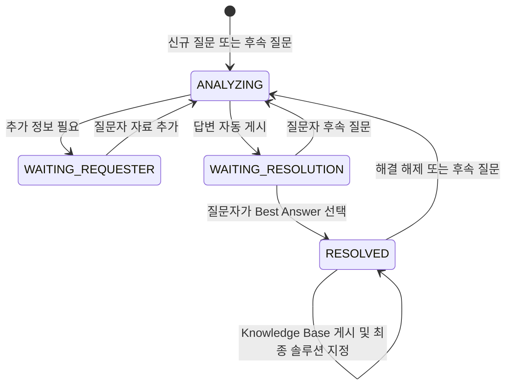

# ADR-0010: Community 대화 답변 자동 게시와 해결 기반 Knowledge Base

- 상태: 승인됨
- 결정일: 2026-08-13
- 범위: ABLESTACK Community Assist
- 관련: Issue #69, PR #65

## 배경

기존 방식은 매 답변을 `증상·원인·해결 방법·추가 고려사항·적용 버전` 문서로 만들고 관리자 승인 후 공개했다. 이 방식은 대화 중인 사용자에게 딱딱하게 느껴지고, 필요한 다음 행동이 무엇인지 파악하기 어려우며, 승인 대기 때문에 답변이 공개되지 않을 수 있다.

## 결정

1. 진행 중 답변은 전문 엔지니어가 플랫폼을 처음 접한 사용자에게 설명하는 대화체로 작성한다.
2. AI-Assistant 답변은 관리자 승인 없이 즉시 공개한다.
3. 질문자가 Best Answer를 선택하기 전까지 Discussion 단위 Conversation과 첨부 자료 맥락을 유지한다.
4. 질문자가 해결 답변을 선택하면 해당 답변을 중심으로 전체 대화를 다시 종합해 Knowledge Base 최종본을 게시한다.
5. Knowledge Base 게시가 확인되면 해당 KB Post를 Discussion의 최종 Best Answer(솔루션)로 지정한다. 질문자가 처음 선택한 답변은 KB 생성 원본과 감사 이력으로 보존한다.
6. Knowledge Base 본문은 제목 없이 `증상`, `원인`, `해결 방법`, `추가 고려사항`, `적용 버전` 순서로 작성한다.
7. Chat은 승인 수단이 아니라 답변 게시, Knowledge Base 게시·솔루션 지정, 처리 실패를 확인하는 관찰 채널로 사용한다.
8. 인프라 상태를 변경하는 Ops 작업의 사람 승인은 그대로 유지한다. 이번 결정은 Community 답변 게시에만 적용한다.

## 안전장치

- 허용된 D0 자료만 AI 답변 생성에 사용한다.
- Doc, Diplo 현재 코드, 관련 제품 코드, Europa Preview, 승인된 플랫폼 자료 순으로 검토한다.
- 내부 저장소·브랜치·커밋·파일 경로와 Citation은 공개 답변에서 제거한다.
- 근거가 부족하면 단정하지 않고 필요한 정보를 요청한다.
- 게시 실패는 HTTP 성공으로 소비하지 않고 동일 Marker로 재시도한다.
- KB 게시 후 솔루션 지정 API를 재조회해 실제 Best Answer가 KB Post와 일치할 때만 완료로 기록한다.
- 자동 게시, KB 게시, 최종 솔루션 지정 이벤트를 Case 이력에 기록한다.
- Chat에는 전체 답변을 복제하지 않고 상태와 Community 링크만 통지한다.

## 상태 전이

## 결과

- 사용자는 승인 대기 없이 답변을 받는다.
- 대화 중 답변은 쉽고 자연스럽게 유지된다.
- 검증된 해결 내용만 최종 Knowledge Base 형식을 갖는다.
- 자동 공개의 위험은 안전한 공개 Projection, 보류 판정, 감사 이력, Chat 관찰로 통제한다.
