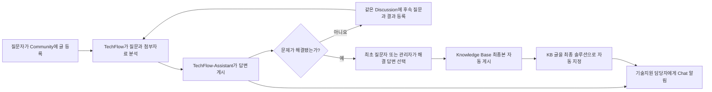

# TechFlow Community 자동화 사용자 가이드

이 문서는 ABLESTACK Community 질문에 AI 답변을 제공하고, 기술지원 담당자가 Synology Chat에서 처리 상태를 확인하며, 해결된 대화를 Knowledge Base로 마무리하는 방법을 설명합니다.

- Chat: [https://chat.ablecloud.io](https://chat.ablecloud.io)
- Community: [https://community.ablecloud.io](https://community.ablecloud.io)
- Chat Bot 이름: `TechFlowAssist`
- Community 답변 계정: `TechFlow-Assistant`

> Community 답변은 관리자 승인 없이 바로 게시됩니다. Chat은 답변 승인 채널이 아니라 새 질문, 자동 답변, 실패, Knowledge Base 생성 상태를 확인하는 채널입니다.

## 1. 전체 이용 흐름



## 2. Chat에서 기술지원 담당자가 Bot을 연결하는 방법

### 2.1 사전 조건

- 운영 관리자가 Synology Chat에 `TechFlowAssist` Bot을 한 번 생성해 두어야 합니다.
- 기술지원 담당자의 Chat 사용자 이름이 TechFlow 담당자 허용 목록에 등록되어 있어야 합니다.
- 담당자마다 별도의 Bot이나 Token을 만들 필요는 없습니다.

운영 관리자가 Bot을 처음 만드는 경우에는 Synology Chat의 `프로필 → 통합 → 봇`에서 Bot을 생성하고 다음 Outgoing URL을 설정합니다.

```text
https://techflow.ablecloud.io/techflow/chat/assist
```

Bot Token은 기술지원 담당자에게 전달하거나 문서에 기록하지 않습니다. 운영 관리자가 서버의 보호된 Secret으로만 설정합니다. 단순 Incoming/Outgoing Webhook을 Bot 대신 만들면 사용자별 연결과 선제 알림이 정상 동작하지 않습니다.

### 2.2 담당자 개인 연결

1. [Synology Chat](https://chat.ablecloud.io)에 자신의 계정으로 로그인합니다.
2. 대화 검색에서 `TechFlowAssist`를 찾아 Bot 대화를 엽니다.
3. 다음 명령을 한 번 전송합니다.

```text
연결
```

4. 현재 Chat 계정이 게시 알림 수신자로 연결됐다는 응답을 확인합니다.
5. 다음 명령으로 연결과 조회 권한을 확인합니다.

```text
대기
```

`승인 권한이 없는 Chat 사용자입니다`라는 응답이 나오면 TechFlow 운영 관리자에게 자신의 **Chat 사용자 이름**을 알려 허용 목록 등록을 요청합니다. Bot Token이나 비밀번호를 전달해서는 안 됩니다.

## 3. Bot에서 Community 글을 확인하는 방법

연결된 담당자는 다음 이벤트가 발생하면 `TechFlowAssist`의 선제 알림을 받습니다.

- 새로운 Community 질문 수집
- AI 답변 게시 완료
- 답변 또는 첨부 처리 실패
- Knowledge Base 게시 및 최종 솔루션 지정 완료

Chat에는 긴 답변 전체를 복사하지 않고 처리 상태와 Community 원문 링크를 표시합니다. 전체 질문과 답변은 알림의 링크를 열어 Community에서 확인합니다.

### 3.1 주요 명령

| 명령 | 용도 | 예시 |
| --- | --- | --- |
| `연결` | 현재 Chat 계정을 알림 수신자로 등록 | `연결` |
| `대기` | 처리 중이거나 실패한 Case 확인 | `대기` |
| `상세 <ID>` | 게시·대화·KB 상태와 원문 링크 확인 | `상세 168` |
| `근거 <ID>` | 내부 기술지원용 분석 근거 확인 | `근거 168` |
| `이력 [Case]` | 자동 게시와 KB 처리 이력 확인 | `이력 a1b2c3d4` |

`상세`와 `근거`에는 Community Discussion 번호 또는 Chat에 표시된 Case ID 앞 8자를 사용할 수 있습니다.

```text
상세 168
상세 a1b2c3d4
근거 168
이력 a1b2c3d4
```

`근거`는 내부 기술지원 검토용입니다. 저장소, 코드 위치, 버전 비교 같은 근거는 일반 Community 사용자에게 공개되지 않습니다.

기존의 `승인`, `수정`, `반려` 명령은 더 이상 답변을 게시하지 않습니다. 현재 정책에서는 AI 답변이 Community에 자동 게시되며 Chat은 그 결과를 관찰하는 데 사용합니다.

### 3.2 주요 상태의 의미

| 상태 | 의미 | 담당자가 할 일 |
| --- | --- | --- |
| `ANALYZING` | 질문이나 후속 댓글을 분석 중 | 잠시 후 `상세`로 다시 확인 |
| `WAITING_RESOLUTION` | 답변 게시 후 질문자의 결과를 기다리는 중 | Community 원문에서 답변 품질과 후속 대화 확인 |
| `RESOLVED` | 최초 질문자 또는 등록 관리자가 해결 답변을 선택했고 KB 처리가 완료됨 | `상세`에서 최종 KB 링크 확인 |
| `FAILED` 또는 대기 목록의 실패 항목 | 답변·첨부·게시 처리에 실패 | 원문과 `이력`을 확인한 뒤 운영 관리자에게 전달 |

## 4. Community에 글을 등록하고 같은 맥락으로 계속 질문하는 방법

### 4.1 처음 질문하기

1. [ABLESTACK Community](https://community.ablecloud.io)에 로그인합니다.
2. 새 Discussion을 작성합니다.
3. 제목에는 가장 중요한 증상을 간단히 적습니다.
4. 본문에는 가능하면 다음 정보를 포함합니다.

   - 사용 중인 제품과 적용 버전
   - 실제로 보이는 증상과 발생 시각
   - 문제가 발생한 작업 순서
   - 이미 시도한 조치와 그 결과
   - 화면 이미지, 오류 메시지, 관련 로그 또는 로그 압축 파일

비밀번호, API Key, Token, 인증 Cookie와 같은 비밀정보는 글이나 첨부파일에 넣지 않습니다. 서로 다른 문제는 별도의 Discussion으로 작성합니다.

TechFlow가 새 글을 수집하면 제품 문서와 소스코드, 필요한 공식 플랫폼 자료, 첨부자료를 함께 검토한 뒤 `TechFlow-Assistant` 계정으로 답변을 게시합니다. 답변에는 우선 실행할 해결 방법과 필요한 CLI 명령, 정상 판정 기준이 포함될 수 있습니다.

### 4.2 후속 질문으로 맥락 이어가기

첫 답변으로 해결되지 않았다면 새 Discussion을 만들지 말고 **같은 Discussion에 댓글로** 다음 내용을 남깁니다.

- 안내된 명령을 실행한 결과
- 성공한 단계와 실패한 단계
- 새로 나타난 오류 메시지
- 요청받은 로그, 이미지 또는 압축 로그
- 추가로 궁금한 내용

예시는 다음과 같습니다.

```text
안내해 준 첫 번째 명령은 정상적으로 실행됐습니다.
하지만 두 번째 명령에서는 "connection refused"가 표시됩니다.
실행 결과와 같은 시각의 로그를 첨부합니다. 다음에는 무엇을 확인해야 하나요?
```

TechFlow는 최초 질문, 이전 답변, 사용자의 실행 결과와 최신 댓글을 같은 Case의 대화로 유지합니다. `TechFlow-Assistant` 자신의 답변에는 다시 반응하지 않으며, 사람 참여자가 올린 새로운 댓글에만 후속 답변을 생성합니다.

### 4.3 사용할 수 있는 첨부자료

- 이미지: PNG, JPEG, WebP
- 텍스트 파일과 일반 로그
- 압축 로그: ZIP, GZIP, TAR.GZ

현재 처리 기준은 파일 1개당 10MB, 압축 해제 합계 20MB, 압축 항목 100개, 한 번의 질문에 연결되는 첨부자료 최대 5개입니다. 큰 로그는 문제 발생 시각 전후와 오류 부분을 중심으로 줄여서 올리면 더 빠르고 정확하게 분석할 수 있습니다.

경로 탈출, 중첩 압축, 압축 폭탄, 실행 파일 위장 또는 비밀정보가 발견된 자료는 차단될 수 있습니다. 일부 첨부가 안전하게 처리되지 않더라도 나머지 질문은 가능한 범위에서 계속 분석합니다.

## 5. 해결 답변을 선택하고 Knowledge Base로 마무리하는 방법

### 5.1 해결 답변 선택

1. 안내된 해결 방법을 실제 환경에 적용합니다.
2. 문제가 해결됐는지 확인합니다.
3. Community Discussion에서 실제 해결에 도움이 된 답변의 메뉴를 엽니다.
4. 화면에 표시되는 `솔루션으로 선택`, `Best Answer` 또는 이에 해당하는 메뉴를 선택합니다.

자동 KB 생성을 시작하려면 다음 중 한 사람이 해결 답변을 선택하면 됩니다.

- 최초 질문을 작성한 사용자
- TechFlow 운영 설정에 해결 승인 관리자로 등록된 Community 관리자

질문자가 직접 처리하기 어려운 경우에는 관리자가 답변과 실제 해결 결과를 확인한 뒤 대신 선택할 수 있습니다. 최초 질문자도 등록 관리자도 아닌 일반 참여자의 선택은 Knowledge Base 생성 신호로 인정되지 않습니다.

### 5.2 자동 Knowledge Base 처리

해결 답변이 선택되면 TechFlow는 다음 작업을 자동으로 수행합니다.

1. 최초 질문부터 해결 시점까지의 전체 대화를 시간순으로 검토합니다.
2. 최초 질문자 또는 등록 관리자가 선택한 해결 답변과 실제 조치 결과를 중심으로 내용을 정리합니다.
3. 잘못된 가설과 반복 내용을 제거합니다.
4. 제목 없이 `증상`, `원인`, `해결 방법`, `추가 고려사항`, `적용 버전` 순서의 Knowledge Base 최종본을 같은 Discussion에 게시합니다.
5. 새로 게시한 Knowledge Base 글을 Discussion의 최종 솔루션으로 지정합니다.
6. 연결된 기술지원 담당자에게 Chat으로 완료 상태와 Community 링크를 알립니다.

처리 완료 여부는 Chat에서 확인할 수 있습니다.

```text
상세 168
이력 a1b2c3d4
```

정상 완료 기준은 `RESOLVED` 상태와 최종 Knowledge Base 링크가 함께 표시되는 것입니다.

### 5.3 해결되지 않았거나 문제가 다시 발생한 경우

- 아직 해결되지 않았다면 솔루션을 선택하지 말고 같은 Discussion에서 후속 질문을 계속합니다.
- 해결 표시 후 문제가 다시 발생했다면 솔루션 선택을 해제하거나 같은 Discussion에 새 결과를 댓글로 남깁니다.
- TechFlow는 기존 Case를 다시 열어 대화 맥락을 이어갑니다.
- 기존 답변이나 KB 글을 삭제하지 않습니다. 이전 조치와 결과가 다음 분석의 중요한 맥락이 됩니다.

## 6. 자주 발생하는 문제

| 증상 | 확인 및 조치 |
| --- | --- |
| `연결`에서 권한 오류가 발생함 | TechFlow 운영 관리자에게 자신의 Chat 사용자 이름을 알려 허용 목록 등록 요청 |
| 새 글 알림이 오지 않음 | Bot 대화에서 `연결`을 다시 실행하고 `대기` 확인. Community에는 답변이 게시됐는지도 원문에서 먼저 확인 |
| `대기`에 아무것도 없음 | 정상적으로 게시되어 질문자 답변을 기다리는 Case는 대기 목록에 없을 수 있으므로 `상세 <Discussion ID>` 사용 |
| 후속 답변이 오지 않음 | 새 Discussion이 아니라 기존 Discussion에 사람 계정으로 댓글을 작성했는지 확인하고 `상세`와 `이력` 확인 |
| 첨부파일이 처리되지 않음 | 지원 형식과 크기 제한 확인. 비밀정보를 제거하고 문제 시각 주변의 필요한 자료만 다시 첨부 |
| 솔루션을 선택했지만 KB가 없음 | 선택자가 최초 질문자 또는 등록 관리자인지 확인하고 `상세`, `이력` 조회. 계속 실패하면 Discussion ID와 Case ID를 운영 관리자에게 전달 |
| Chat에서 답변 전체가 보이지 않음 | 정상 동작입니다. Chat의 Community 링크를 열어 원문과 전체 답변 확인 |

## 7. 빠른 사용 예시

```text
1. 기술지원 담당자: Chat의 TechFlowAssist에게 "연결"
2. 질문자: Community에 새 Discussion과 필요한 로그 등록
3. TechFlow: AI 답변 자동 게시, 담당자에게 Chat 알림
4. 질문자: 같은 Discussion에 실행 결과와 후속 질문 등록
5. TechFlow: 기존 맥락을 유지해 다음 해결 방법 답변
6. 최초 질문자 또는 등록 관리자: 실제로 해결한 답변을 솔루션으로 선택
7. TechFlow: KB 최종본 게시 및 최종 솔루션 지정
8. 기술지원 담당자: Chat에서 "상세 <Discussion ID>"로 완료 확인
```
