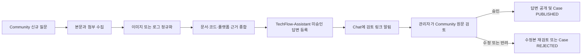
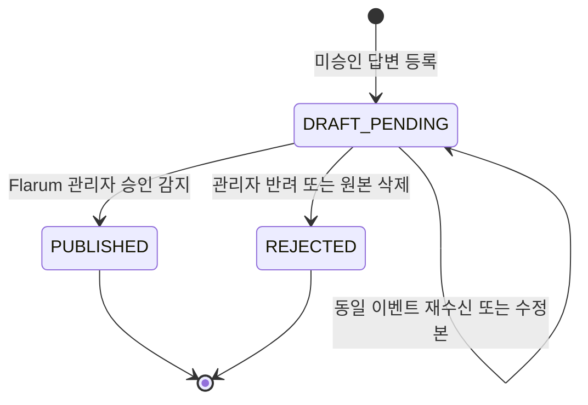

# Issue #64 Community 원문 승인형 AI 답변 설계

- 상태: 구현 및 시험 완료, Draft PR 검토 대기
- 대상: ABLESTACK Community 기술지원 Assist
- 목적: Chat 메시지 길이 제한과 근거 노출 문제를 없애고, 담당자가 Community 원문에서 전체 답변과 첨부 분석 결과를 검토한 뒤 공개하도록 한다.

## 1. 해결할 문제

기존 Chat 중심 검토는 긴 답변이 잘려 문장 전체와 문맥을 확인하기 어렵다. 이미지나 로그 압축 파일의 분석 결과도 짧은 메시지 안에서 검증하기 어렵다. 따라서 Chat은 새 검토 건을 알리는 진입점으로만 사용하고, 전체 답변의 단일 원본은 Community에 둔다.

## 2. 목표 흐름

## 3. 계정과 권한 경계

- `TechFlow-Assistant`는 관리자 계정이 아닌 일반 Member 계정이다.
- AI Gateway는 Flarum API 키와 별도 사용자 식별자를 런타임 Secret으로 주입받아 이 계정으로 답변한다.
- Flarum Approval 확장이 답변을 `승인 대기 중`으로 보관한다.
- 미승인 답변이 공개 상태로 생성되면 Gateway는 성공으로 처리하지 않는 fail-closed 정책을 적용한다.
- 공개 결정은 Flarum 승인 권한을 가진 관리자가 Community 화면에서 수행한다.
- 사용자 비밀번호, API 키, Chat 토큰은 저장소·문서·로그에 기록하지 않는다.

## 4. 답변 품질 계약

### 4.1 출력 구조

모든 공개 후보 답변은 다음 순서를 지킨다.

1. 증상: 사용자가 겪은 현상만 짧게 정리
2. 원인: 확인된 사실과 가능성이 높은 원인을 구분
3. 해결 방법: 안전한 순서, 필요한 CLI 확인 명령, 작업 후 확인 포함
4. 추가 고려사항: 서비스 영향, 미확인 정보, 우회 또는 후속 점검
5. 적용 버전: Diplo 현재 동작과 Europa 향후 개선 정보를 분리

어려운 용어는 처음 나올 때 쉬운 말로 풀고, 증상 항목에 원인·구조·점검 절차를 섞지 않는다.

### 4.2 내부 근거 우선순위

1. ABLESTACK 문서
2. ABLESTACK 소스 코드
   - 현재 제품 판단: `ablestack-cloud`의 `ablestack-diplo`
   - 관련 코드: `ablestack-wall`, `ablestack-cockpit-plugin`, `ablestack-genie`, `ablestack-kickstart`, `ablestack-qemu-exec-tools`
   - 향후 개선 참고: `ablestack-cloud`의 `ablestack-europa`; 미출시 Preview임을 명시
3. libvirt·QEMU·KVM 공식 문서와 승인된 플랫폼 자료
4. 위 계층으로 부족할 때만 승인된 기타 외부 자료

근거 원문과 코드 위치는 내부 Evidence Ledger에 남기되 일반 사용자 답변에는 표시하지 않는다. 내부 담당자가 Chat에서 `근거 <Case ID>`를 명시했을 때만 별도로 조회한다.

## 5. 입력 유형과 처리 계약

| 입력 | 수집·정규화 | 답변에 사용하는 방법 | 주요 방어선 |
| --- | --- | --- | --- |
| 텍스트 | 질문 본문 정리 | 문서·코드·플랫폼 근거와 종합 | 프롬프트 주입을 사실 근거로 취급하지 않음 |
| 이미지 | Flarum `img src` 수집 후 이미지 Artifact 등록 | 화면에 실제로 보이는 상태와 문구만 관찰 사실로 사용 | 형식·크기·해상도·무결성 검증 |
| 일반 로그 | 텍스트 정규화와 비밀정보 마스킹 | 오류·경고·시간 흐름을 질문과 함께 분석 | D0 제한, 크기 제한, 자동 폐기 |
| ZIP·GZIP·TAR.GZ | FoF Upload UUID를 다운로드 API로 해석하고 안전하게 압축 해제 | 파일별 근거 위치를 보존한 정규화 로그 분석 | 경로 탈출, 압축 폭탄, 파일 수·압축률·추출량 제한 |

FoF Upload가 `application/force-download` 또는 `application/octet-stream`으로 응답하는 경우에도 `Content-Disposition` 파일명과 확장자를 이용해 허용된 실제 형식을 판별한다.

## 6. Chat 계약

- 신규 질문이 들어오면 연결된 Reviewer에게 즉시 알린다.
- AI 초안이 준비되면 제목, Case 식별자, 상태와 Community 검토 링크만 보낸다.
- Chat 알림에는 전체 답변이나 Citation을 넣지 않는다.
- `상세` 동작 역시 Community 원문 링크로 안내한다.
- 근거는 허용된 Reviewer가 `근거 <Case ID>`를 명시한 경우에만 내부용으로 반환한다.
- 승인·수정·반려의 최종 사용자 경험은 Community 원문 검토로 일원화한다.

## 7. 상태와 멱등성

- Discussion ID는 Community Case의 고유 키다.
- Review Post ID는 부분 고유 인덱스로 중복 연결을 막는다.
- 미승인 Post 조회는 반드시 Assistant 사용자 문맥으로 수행한다.
- 네트워크 실패나 프로세스 재시작 후 Review Post가 누락된 Case는 reconcile 단계에서 복구한다.
- 이미 처리된 이벤트는 같은 Case·버전 결과를 반환한다.

## 8. 완료 기준

- 별도 일반 AI 계정으로 작성한 답변이 공개 전 `승인 대기 중` 상태다.
- Chat에서 잘리지 않은 Community 원문 링크로 이동할 수 있다.
- 텍스트, 실제 이미지, 실제 ZIP 로그 각각에 대해 신규 Discussion부터 AI 초안까지 E2E가 성공한다.
- 이미지 관찰과 로그 내용이 최종 답변에 올바르게 반영된다.
- 관리자가 Community에서 승인하면 Case가 `PUBLISHED`로 동기화된다.
- 전체 자동화 테스트와 배포 후 Health가 통과한다.
- GitHub→Chat 웹훅 컨테이너는 재시작·재배포·설정 변경 없이 동일 상태다.
