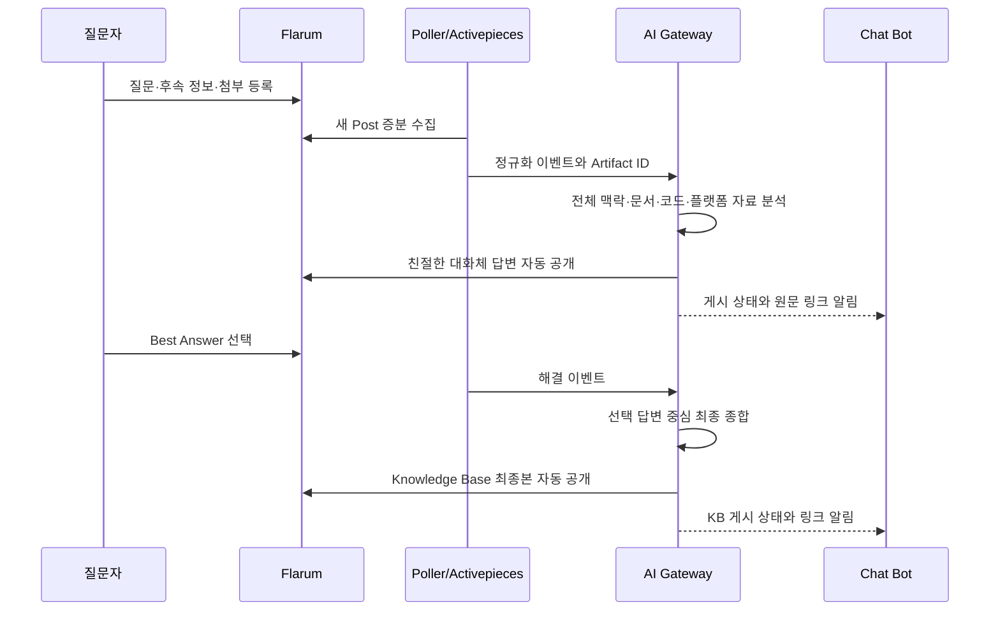

# Issue #69 Community 자동 게시와 Knowledge Base 설계

## 목표

Community Assist의 진행 중 답변은 친절한 엔지니어 대화로 제공하고, 질문자가 해결 표시를 한 뒤에만 검증된 대화를 Knowledge Base 문서로 확정한다. 관리자 승인 단계는 제거하고 Chat은 처리 관찰 채널로 전환한다.

## 아키텍처

## 답변 정책

### 진행 중 답변

- 현재 판단을 쉬운 말로 먼저 설명한다.
- 사용자가 수행할 확인을 순서대로 안내한다.
- 부족한 정보만 구체적으로 요청한다.
- 이미 받은 자료를 반복 요청하지 않는다.
- 고정된 트러블슈팅 제목과 다섯 개 섹션을 매번 강제하지 않는다.
- 근거가 부족한 `ABSTAINED` 상태도 빈 초안으로 남기지 않고, 확인에 필요한 자료를 요청하는 친절한 답변으로 공개한다.

### 해결 후 Knowledge Base

- 질문자가 선택한 해결 답변을 최우선 사실로 사용한다.
- 전체 대화와 첨부에서 실제로 확인된 결과를 보완한다.
- 제목 없이 증상, 원인, 해결 방법, 추가 고려사항, 적용 버전으로 정리한다.
- 적용 버전은 `ABLESTACK Diplo`, `ABLESTACK Europa`로 표시한다.
- 내부 Evidence Ledger와 소스 위치는 공개하지 않는다.

## 실패와 재시도

| 단계 | 실패 처리 |
| --- | --- |
| AI 생성 | 503 반환, Post Seen 미진행, 동일 이벤트 재시도 |
| Assistant Post 생성 | Marker로 기존 Post 검색 후 재사용 |
| Flarum 공개 전환 | 공개 확인 실패 시 Case를 PUBLISHED로 만들지 않음 |
| KB 생성 | 해결 상태는 유지하고 KB 미게시 상태로 재시도 |
| Chat 알림 | Community 게시를 되돌리지 않고 별도 오류 기록 |

## 데이터 모델

`community_case`에 KB Post, URL, 해결 원본 Post, 본문, Version, 게시 시각을 저장한다. 일반 답변은 `AUTO_PUBLISHED`, 최종본은 `KNOWLEDGE_BASE_PUBLISHED` 이벤트로 감사 이력을 남긴다.

## 완료 기준

- 진행 답변에 문서형 제목이 없고 친절한 안내·다음 행동·정보 요청이 포함된다.
- 답변은 승인 없이 AI-Assistant 계정으로 공개된다.
- Chat 버튼은 상태 확인과 내부 근거 조회만 제공한다.
- 질문자 해결 선택 후 KB가 한 번만 생성된다.
- 해결 해제·후속 질문 시 Case가 재개된다.
- 자동 테스트, 시험 서버 E2E, PDF/PPTX 보고 자산이 통과한다.
