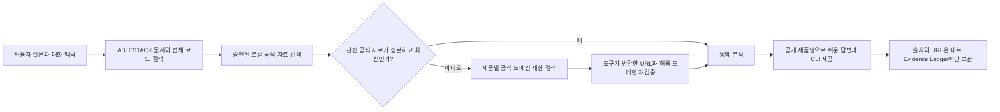

# Issue #76 게스트 OS 및 공식 플랫폼 근거 보강 설계

## 1. 목표

Community Discussion #168에서 Ubuntu 24.04의 `qemu-guest-agent.service could not be found`가 명확한데도 설치 명령을 제공하지 못하고 다른 관리자에게 작업을 넘긴 문제를 해결한다. 동시에 ABLESTACK 제품 기능이 사용하는 기반 기술의 공식 자료를 통제된 방식으로 보완해, 로컬 자료만으로 답을 억지로 만들거나 근거 부족으로 멈추지 않게 한다.

공개 제품명은 다음처럼 유지한다.

| 공개 제품명 | 내부 검색 확장 | 허용 공식 문서 |
| --- | --- | --- |
| Mold | Apache CloudStack, 필요 시 libvirt/QEMU/KVM | `docs.cloudstack.apache.org`, `cloudstack.apache.org`, `libvirt.org`, `qemu.org` |
| Glue | Ceph | `docs.ceph.com` |
| Koral | Kubernetes | `kubernetes.io` |
| Wall | Grafana | `grafana.com/docs` |
| 가상머신 OS | Ubuntu, RHEL/Rocky, Windows | Ubuntu, Red Hat, Rocky, Microsoft 공식 문서 |

## 2. 답변 근거 순서

1. ABLESTACK 문서와 승인된 내부 운영 지식
2. Diplo 현재 출시 코드와 연관 제품 코드 전체, Europa Preview 비교
3. 승인된 로컬 공식 플랫폼 문서 스냅샷
4. 로컬 공식 자료가 없거나 30일 갱신 기한을 넘겼을 때만 공식 도메인 웹 검색

공식 플랫폼 문서는 ABLESTACK 고유 동작을 증명하지 않는다. 패키지 설치, 표준 서비스 상태, 기반 기술의 일반 진단 명령처럼 제품 자료가 다루지 않는 부분만 보완한다. Mold 질문은 관리 계층(CloudStack), 호스트 가상화 계층(libvirt/QEMU/KVM), 게스트 OS 계층을 구분한다. 충돌하면 ABLESTACK 문서와 현재 Diplo 구현을 우선한다.

## 3. 실행 흐름

## 4. 웹 검색 경계

- 운영자가 `TECHFLOW_OFFICIAL_WEB_SEARCH_ENABLED=true`를 설정한 OpenAI Provider 환경에서만 동작한다.
- 검색 도구는 필수 호출로 고정하고 허용 도메인 목록을 API 필터에 전달한다.
- 응답 텍스트의 URL을 신뢰하지 않고 `web_search_call.action.sources`에 실제로 포함된 URL만 근거로 수용한다.
- 질문의 URL, 이메일, IP 주소와 비밀정보 형태는 외부 검색 전에 제거한다.
- 이미지, 로그, 압축 파일 내용과 내부 Citation은 웹 검색으로 보내지 않는다.
- 공식 검색이 실패해도 로컬 근거 분석은 계속하며, 근거가 부족하면 안전하게 추가 정보를 요청한다.
- 검색 결과 URL과 수집 시각은 내부 Citation에만 남기고 Community 공개 답변에는 표시하지 않는다.

## 5. 사용자 답변 원칙

- 질문자가 가상머신을 관리하는 사용자라면 OS가 명확한 설치 절차를 직접 제공한다.
- 해결책과 실행 위치를 먼저 설명하고, 명령은 독립된 `bash` 또는 `powershell` 코드 블록으로 제공한다.
- 정상 판정 기준을 함께 제시한다.
- 첫 조치로 해결되지 않을 때만 정확한 서비스 로그나 통신 장치 상태를 요청한다.
- 공개 문장에서는 Mold, Glue, Koral, Wall을 사용한다. 기반 기술 이름은 명령, 설정 키, 파일 경로, API 이름처럼 기술적으로 꼭 필요한 경우에만 쓴다.

## 6. 완료 기준

- Ubuntu, RHEL/Rocky, Windows QEMU Guest Agent 설치·검증 Golden Case 통과
- Mold, Glue, Koral, Wall의 내부 검색어 확장과 공식 도메인 라우팅 시험 통과
- 비허용 도메인과 검색 도구가 반환하지 않은 URL 차단 시험 통과
- 웹 검색 전 식별정보·비밀정보 제거 시험 통과
- Discussion #168 답변에 Ubuntu 설치 명령, 성공 기준, 실패 시 다음 진단이 포함됨
- Gateway·Poller 정상, 기존 GitHub-to-Chat 보호 서비스 컨테이너 ID·이미지·재시작 횟수 무변경
- 설계·검증 보고서, PDF, PPTX, 발표 PDF와 자산 Manifest 생성

## 7. 롤백

1. `TECHFLOW_OFFICIAL_WEB_SEARCH_ENABLED=false`로 외부 보완 검색만 즉시 중단한다.
2. 문제가 답변 정책에 있으면 Gateway와 Poller를 직전 0.14.6 이미지로 되돌린다.
3. 로컬 승인 자료는 파일 단위로 이전 버전 복구하며 DB Migration은 수행하지 않는다.
4. Discussion #168의 수정 답변은 원본 Conversation을 삭제하지 않고 Flarum Post 이력으로 보존한다.
