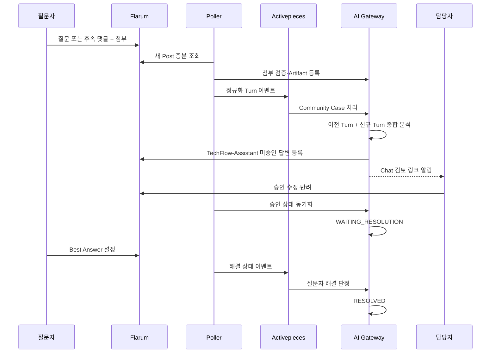
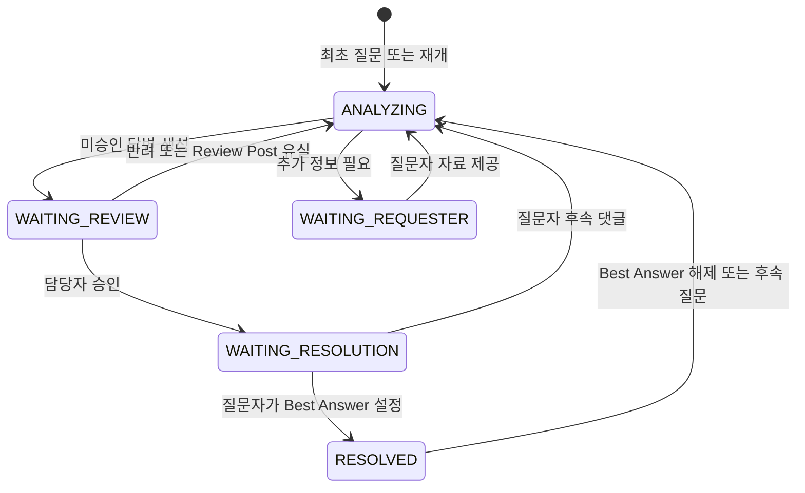

# Issues #66-#68 Community 지속 대화와 해결 상태 설계

- 작성일: 2026-08-13
- 대상: Issue #21 Community Assist 후속 구현
- 관련 이슈: #23, #24, #64, #66, #67, #68
- 구현 버전: TechFlow AI Gateway 0.13.0

## 1. 목표

하나의 Community 질문을 한 번 답하고 끝내지 않는다. 질문자가 후속 댓글과 이미지, 로그, 로그 압축 파일을 추가하면 같은 Case의 대화 맥락으로 누적 분석한다. 담당자 승인 답변이 공개된 뒤에도 질문자가 Best Answer로 해결 표시를 하기 전까지 Case를 유지한다. 해결 표시를 해제하면 같은 Case를 다시 연다.

사용자에게 보이는 답변에는 별도 제목을 만들지 않는다. 본문은 `증상`, `원인`, `추가로 필요한 정보`, `해결 방법`, `추가 고려사항`, `적용 버전`으로 시작한다. 적용 버전의 제품 표기는 `ABLESTACK Diplo`, `ABLESTACK Europa`를 사용한다.

## 2. 책임 경계

| 구성요소 | 책임 |
| --- | --- |
| Flarum Community | 질문·후속 댓글·첨부·승인·Best Answer의 원본 상태 |
| Community Poller | Discussion과 Post 증분 수집, 작성자 역할 판별, 해결 상태 변화 감지 |
| Activepieces | 이벤트 전달과 Gateway API 호출 순서 실행 |
| Artifact Store | 이미지·로그·ZIP/GZIP/TAR.GZ 검증, 추출, 마스킹, 수명주기 관리 |
| AI Gateway | Conversation·Turn·Response 상태, 종합 검색, 답변 생성, 멱등성·감사 |
| TechFlow-Assistant | 미승인 답변 원문을 Flarum에 등록하는 일반 계정 |
| 담당자 | Community Approval로 답변 승인·수정·반려 |
| 질문자 | Best Answer 설정·해제로 최종 해결 여부 결정 |

Activepieces는 정책을 소유하지 않는다. 질문자 판정, 상태 전이, 승인 무효화, 근거 공개 제한은 AI Gateway와 Flarum이 소유한다.

## 3. 전체 흐름

## 4. 데이터 모델

### 4.1 Community Case

- `requester_user_id`: 최초 질문자 Flarum User ID
- `last_seen_post_id`: 마지막으로 반영한 Post
- `context_version`: 누적 맥락 버전
- `conversation_state`: 대화 상태
- `resolved_post_id`, `resolved_by_user_id`, `resolved_at`: 해결 증적
- `reopened_at`: 해결 해제 후 재개 시각

### 4.2 Community Turn

Discussion의 각 Post를 `REQUESTER`, `STAFF`, `ASSISTANT` 역할로 저장한다. `(case_id, source_post_id)`를 유일 키로 사용해 Poll 재시도에서도 중복 Turn을 만들지 않는다. 첨부는 Artifact ID만 연결하고 원본 바이트를 이벤트나 Activepieces 실행 로그에 넣지 않는다.

### 4.3 Community Response

후속 질문마다 `draft_version`을 증가시킨다. 각 버전은 답변, 상태, Review Post, 승인자를 별도로 보존한다. 새 초안이 생기면 이전 승인은 현재 초안에 재사용되지 않는다.

## 5. 상태 모델

`RESOLVED`는 Best Answer 설정자가 최초 질문자와 같을 때만 허용한다. 다른 사용자가 선택한 답변은 `WAITING_RESOLUTION`에 남기고 별도 확인 대상으로 기록한다.

## 6. 이벤트 계약

Post 이벤트는 Discussion ID, Post ID·번호, 최초 질문자, Post 작성자, 역할, 답변 생성 여부, 본문, 태그, Artifact ID를 포함한다. 해결 이벤트는 `resolutionOnly=true`, Best Answer Post·User·시각을 포함한다.

해결 이벤트 멱등성 키에는 원본 ISO 시각을 직접 넣지 않는다. `discussion|post|setAt`을 SHA-256으로 요약해 허용 문자만 포함한 키를 만든다. 이 규칙은 `:`와 `+`가 들어간 ISO 8601 시각 때문에 요청이 거절되는 문제를 방지한다.

## 7. 답변 생성 규칙

1. 같은 Discussion의 모든 Turn을 시간순으로 묶는다.
2. ABLESTACK 문서, Diplo 현재 코드와 관련 제품 코드, Europa Preview, 공식 libvirt/QEMU/KVM, 승인된 외부 자료 순으로 검토한다.
3. 이미지와 로그를 질문과 맞는 자료인지 먼저 판별한다.
4. 알 수 없는 내용은 추정하지 않고 `추가로 필요한 정보`에서 구체적으로 요청한다.
5. CLI가 필요하면 권한, 읽기 전용 여부, 기대 결과, 위험과 제품 API 우선 원칙을 함께 쓴다.
6. 사용자용 본문에는 Citation·Repository·Commit·내부 경로를 노출하지 않는다.
7. 문서 제목을 붙이지 않고 `### 증상`으로 시작한다.
8. 적용 버전은 `ABLESTACK Diplo`, `ABLESTACK Europa`로 표시한다.

## 8. 실패와 보상

- Artifact 실패: 답변을 만들지 않고 실패 사유를 기록한다.
- Review Post 생성 실패: `WAITING_REVIEW`로 성공 처리하지 않고 재조정 대상으로 남긴다.
- Review Post 영구 삭제: `REJECTED/ANALYZING`으로 닫아 승인 우회를 차단한다.
- Chat 알림 실패: 최대 3회 재시도하고 Case와 Review Post는 보존한다.
- 해결 이벤트 실패: Poller 다음 변경에서 재시도할 수 있도록 안전한 멱등성 키를 쓴다.
- 후속 Turn 생성 실패: 기존 공개 답변과 이전 Turn은 그대로 두고 신규 Turn만 재처리한다.

## 9. 완료 기준

- 답변 제목 미생성
- `ABLESTACK Diplo/Europa` 표기
- 후속 댓글이 같은 Case의 새 Draft Version 생성
- 이미지와 ZIP 로그가 같은 Turn의 Artifact로 연결
- Assistant와 담당자 댓글은 자동 답변을 재귀 생성하지 않음
- 승인 후 `WAITING_RESOLUTION`
- 질문자 Best Answer 후 `RESOLVED`
- Best Answer 해제 후 `ANALYZING`, 재설정 후 다시 `RESOLVED`
- 중복 Post·해결 이벤트가 상태나 응답을 중복 생성하지 않음
- GitHub→Chat 보호 서비스 무변경
