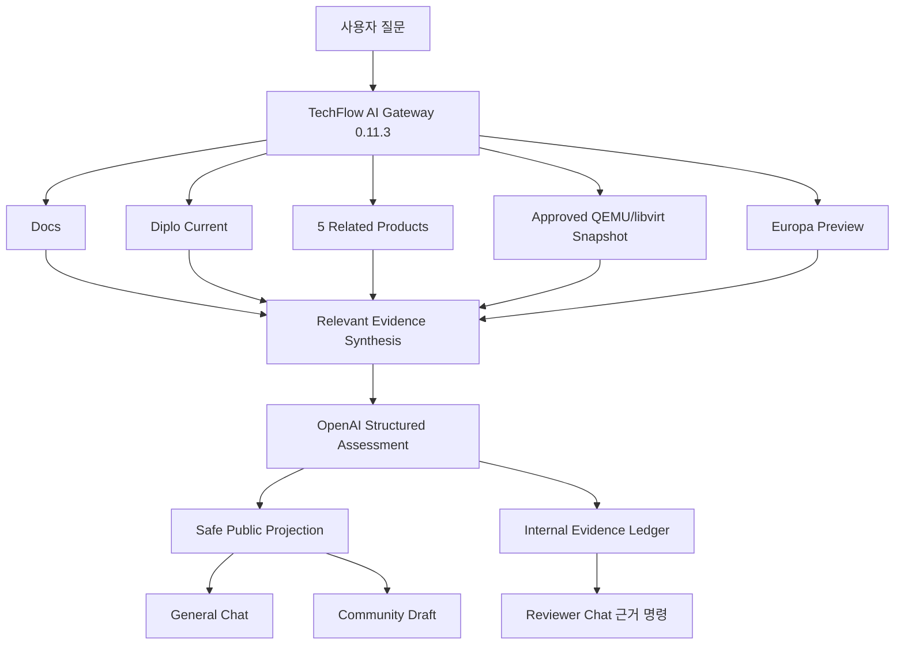

# Issue #62·#63 구현·검증 보고서

## 결과 요약

Diplo 현재 출시판과 Europa 미출시 프리뷰의 역할을 분리한 전 Source 기술지원 경로에 승인된 QEMU/libvirt 플랫폼 참조를 추가했다. 일반 Chat 질문과 Community Draft는 사용자용 안전 Projection만 제공한다. 승인 담당자의 Chat `상세`도 답변만 표시하며, 명시적인 `근거 <Case>` 명령에서만 9개 근거 영역 Coverage와 Citation을 제공한다.

AI Gateway `0.11.3`은 공개 답변을 `증상·원인·해결 방법·추가 고려사항·적용 버전` 순서의 트러블슈팅 문서로 표준화한다. 콘솔이 `연결중`에 머무는 단일 VM 사례는 ABLESTACK 코드 결함이 아니라 QEMU VNC 세션/소켓의 런타임 상태 문제인 `CURRENT_RUNTIME_ISSUE`로 분류한다. 읽기 전용 CLI 확인, 운영 VM의 라이브 마이그레이션 우선, 정지 후 시작 대안과 서비스 영향을 함께 안내한다.

## 구현 자산

- `app/versioned_assist.py`: Source 역할, 전체 검토, 관련 근거 선별, Ledger, 안전 Projection
- `app/responses.py`: 현재판·프리뷰 구조화 Schema와 엄격한 프리뷰 정책
- `app/main.py`: 전 Source Assist, Community Draft, 일반 Chat Q&A
- `app/data/versioned-assist-golden-v1.json`: 7개 판정 Golden Case
- `app/data/curated-platform-references-v1.json`: 승인된 운영 지식과 QEMU/libvirt 공식 문서 로컬 스냅샷
- `app/platform_references.py`: 승인 상태·질문 관련성·Content Digest 기반 참조 로더
- `tests/test_versioned_assist.py`: 역할·Coverage·Projection·Golden 계약 시험
- `app/chat_assist.py`: 상세/근거 출력 분리와 Reviewer 전용 `근거` 명령
- `scripts/poll_flarum.py`: 신규 글 Poll 기본·최소 간격 10초

## 최종 아키텍처

## 자동 시험

| 항목 | 결과 |
|---|---:|
| Python Unit/Contract Test | 172 PASS |
| OpenAPI Operation | 33 |
| Versioned Golden Case | 7 |
| 현재 오류·프리뷰 개선 Case | 포함 |
| 현재 오류·프리뷰 미확인 Case | 포함 |
| 외부 Projection 내부 계보 검사 | PASS |
| `github-chat-v1` 동결 가드 | PASS |

## 시험 서버 배포

| 항목 | 최종 값 |
|---|---|
| OS | Ubuntu 24.04 |
| Root Volume | 1005 GiB, 사용 28 GiB, 여유 936 GiB |
| AI Gateway Image | `techflow/ai-gateway:issue-63-chatbot-proactive` |
| Gateway Image ID | `sha256:55782ca7adf56954440b12bc5bcc3c6e660e805487b7e43734528fd49afbbe65` |
| Gateway Version | `0.11.3` |
| Database / Vector | ready / ready |
| Provider | OpenAI |
| Gateway / Community Poller | healthy / running |
| 최종 백업 | `/home/ablecloud/techflow-ai-gateway-backups/chatbot-proactive-predeploy-20260812T121158Z` |

기존 0.11.0 배포 전 백업도 `/home/ablecloud/techflow-ai-gateway-backups/issue62-predeploy-20260812T095938Z`에 보존되어 있다.

Secret 파일과 값은 복사·출력·문서화하지 않았다. Database Migration은 없으며 기존 `source_metadata` JSON에 Evidence Ledger를 저장한다.

## E2E 결과

### E2E 0: 트러블슈팅 문서 형식

- Gateway: `0.11.2`, Image `techflow/ai-gateway:issue-63-console-golden`
- 일반 Chat: `ANSWERED`, 1,881자, 필수 Section 5개 순서 검증 PASS
- Community Discussion: [#151](https://community.ablecloud.io/d/151)
- Community Case: `9be04737...`, `DRAFT_PENDING / ANSWERED`
- Community Draft: 1,806자, 필수 Section 5개 순서 검증 PASS
- Coverage: 8개, 내부 Citation: 4개
- 외부 저장소·Profile·Commit·경로·라인 노출: 0건
- `증상 → 원인 → 해결 방법 → 추가 고려사항 → 적용 버전` 순서를 Chat과 Community에서 동일하게 확인
- 자동 게시·승인: 수행하지 않음

### E2E 1: 범용 질문 보류

- 질문: Diplo 환경의 일반적인 VM 배포 실패 원인과 Europa 개선 여부
- 전체 Coverage: 8개 Profile 검색 수행
- 결과: `ABSTAINED`
- 현재판: `INSUFFICIENT_EVIDENCE`
- 프리뷰: `PREVIEW_INSUFFICIENT`
- 판정: 환경·로그 없이 원인을 확정하지 않아 PASS

### E2E 2: 일반 Chat 답변

- 질문: Diplo `StorageServiceHostCommand` 주요 필드와 Europa 관련 변경
- 결과: `ANSWERED`, 안전 Projection 1,612자
- 내부 경로·Profile·GitHub URL 노출: 0건
- Reviewer 권한이 없는 유효 Chat 사용자 기술 질문: 허용
- 판정: PASS

### E2E 3: Community 최종 Case

- Discussion: [#150](https://community.ablecloud.io/d/150)
- Case: `c6729fa1...`
- 상태: `DRAFT_PENDING / ANSWERED`
- Draft: 1,810자
- 내부 Citation: 4개
- Coverage: 8개
- 공개 Draft 금지 패턴: 0건
- 자동 게시: 수행하지 않음. 담당자 승인 대기
- 판정: PASS

### E2E 4: Reviewer Chat 상세·근거 분리

| Profile | 역할 | 최종 관련 근거 |
|---|---|---:|
| SHARED_DOCS | 현재 문서 | 0 |
| CLOUD_DIPLO | 현재 출시 Cloud | 2 |
| WALL_MAIN | 현재 연관 제품 | 0 |
| COCKPIT_DIPLO | 현재 연관 제품 | 0 |
| GENIE_MASTER | 현재 연관 제품 | 0 |
| KICKSTART_MASTER | 현재 연관 제품 | 0 |
| QEMU_EXEC_TOOLS_MAIN | 현재 연관 제품 | 0 |
| CURATED_PLATFORM_REFERENCE | 승인 플랫폼 참조 | 4 |
| CLOUD_EUROPA | 미출시 프리뷰 | 2 |

Reviewer `상세 <Case>`에는 질문과 답변만 표시되고 Citation·Source Profile·Coverage·판정 코드는 표시되지 않는다. `근거 <Case>`를 명시했을 때만 Commit·파일·라인 또는 공식 참조 URL과 전체 Coverage, 구조화 판정이 표시된다. Reviewer가 아닌 Chat 사용자의 `근거` 명령은 `403`으로 거부한다.

신규 미답변 Discussion은 10초 Poll로 감지한 뒤 최초 Case 생성 시 연결된 Reviewer에게 자동 Chat 알림을 보낸다. 알림 전송은 최대 3회 재시도하고 성공·실패·Reviewer 미연결 상태를 구조화 로그로 구분한다. 따라서 담당자는 `대기`를 먼저 실행하지 않아도 검토 대상 발생을 인지한다.

### E2E 4-1: 신규 글 선제 알림

- Discussion: [#155](https://community.ablecloud.io/d/155)
- Case: `dc5f14bb...`, `DRAFT_PENDING / ANSWERED`
- Poll: 10초 주기에서 신규 글 감지
- 수신 대상: 연결 Reviewer `user_id=19`
- Chat 표시: `새 Community 글이 등록되어 검토가 필요합니다`와 Discussion 제목 확인
- 발송 계약: `SYNO.Chat.External method=chatbot version=2`
- 관측성: 구조화 표준 출력 Unit Test와 `request_completed` 런타임 로그 확인
- 자동 승인·게시: 수행하지 않음
- 판정: PASS

초기 구현은 정상적인 Chat Bot Token을 Incoming Webhook용 `method=incoming`에 보내 `404 bot type error`가 발생했다. Chat 통합 설정의 실제 받는 URL과 Synology 공식 Bot 계약을 대조해 `method=chatbot`으로 교정했다. 기존 Bot Token, Outgoing URL과 Reviewer 연결은 유지했으며 별도 Incoming Webhook Token은 만들지 않았다.

## 구현 중 발견과 개선

첫 구현은 8개 Profile의 벡터 상위 결과를 모두 생성 컨텍스트에 넣어 직접 관련 없는 근거 때문에 정확한 코드 질문도 보류됐다. 검색 수행과 생성 근거 사용을 분리하고, 질문에 명시적 코드 식별자가 있으면 해당 식별자와 직접 일치하는 결과만 채택하도록 수정했다. 이후 Diplo·Europa 각각 2개 근거만 사용해 Chat과 Community 답변이 정상 생성됐다.

### E2E 5: Mold 콘솔 `연결중` Golden Question

질문은 다음 문장으로 고정했다.

> Mold에서 가상머신의 콘솔 보기를 클릭하면 콘솔 화면이 표시되지만 "연결중"이라고 표시되고, 더 이상 화면을 보여주지 않습니다. 콘솔을 보려면 어떻게 해야 하나요?

| 검증 항목 | 실제 결과 | 판정 |
|---|---|---:|
| 일반 Chat | `ANSWERED` | PASS |
| 현재판 판정 | `CURRENT_RUNTIME_ISSUE`, ABLESTACK 코드 결함 아님 | PASS |
| Source Coverage | 8개 제품 Profile + 승인 플랫폼 참조 등 9개 영역 | PASS |
| 내부 Citation | 승인 운영 지식, QEMU QMP VNC 상태, libvirt VNC 엔드포인트, QEMU 마이그레이션 | PASS |
| Community | 신규 검증 Discussion, `DRAFT_PENDING / ANSWERED` | PASS |
| Community Draft | 필수 Section 5개와 안전 CLI 포함 | PASS |
| 사용자 답변 내부 계보 노출 | 저장소·브랜치·Commit·경로·라인 0건 | PASS |
| 자동 승인·게시 | 수행하지 않음 | PASS |

검증된 사용자 답변의 핵심 내용은 다음과 같다.

#### 증상

- Mold에서 콘솔 화면은 열리지만 `연결중`에서 멈추고 더 이상 화면이 표시되지 않는다.
- 이 현상은 VNC 콘솔 연결에만 영향을 주며 게스트 운영체제와 그 안의 서비스는 정상 동작할 수 있다.

#### 원인

- 이전 콘솔 접속이 네트워크 단절이나 브라우저 강제 종료로 정상 종료되지 않아, 가상머신 QEMU 프로세스 내부의 VNC 통신 소켓 또는 기존 VNC 세션이 비정상 상태로 남을 수 있다.
- 이 상태에서는 새 콘솔 접속 요청이 정상 처리되지 않아 화면이 `연결중`에서 계속 대기한다.

#### 해결 방법

1. 호스트 관리자 권한으로 `sudo virsh domstate <VM>`, `sudo virsh domdisplay <VM> --type vnc`, `sudo virsh qemu-monitor-command <VM> --pretty '{"execute":"query-vnc"}'`를 실행해 VM 상태, VNC 엔드포인트와 연결 Client를 읽기 전용으로 확인한다.
2. 필요하면 `sudo virsh dumpxml <VM> | sed -n '/<graphics/,/<\/graphics>/p'`와 `sudo journalctl -u libvirtd -u virtqemud --since '-15 min' --no-pager | grep -Ei 'vnc|console|websocket|qemu|error'`로 그래픽 정의와 최근 오류를 확인한다.
3. 운영 중인 서비스는 호스트 호환성·스토리지·네트워크·여유 자원을 확인한 뒤 Mold에서 라이브 마이그레이션한다. 목적지 호스트의 QEMU 프로세스와 VNC 엔드포인트가 새로 구성되며 서비스 중단을 최소화할 수 있어 우선 권장한다.
4. 라이브 마이그레이션이 불가능하면 가상머신을 정지 후 시작한다. 기존 QEMU 프로세스가 종료되고 VNC 소켓이 초기화되지만 게스트 서비스 중단이 발생한다.
5. ABLESTACK 관리 가상머신에 직접 `virsh migrate`를 실행하지 않는다. 상태 변경은 Mold 또는 승인된 제품 API로 수행한다.

#### 추가 고려사항

- 라이브 마이그레이션 또는 정지 후 시작 뒤에도 지속되거나 같은 호스트의 여러 VM에서 동시에 발생하면 Console Proxy·WebSocket·DNS·방화벽 경로를 후순위로 점검한다.
- CLI 출력에 비밀번호·토큰을 포함하지 않고, 실행 전 VM 식별자와 변경 영향을 확인한다.

#### 적용 버전

- 현재 적용 기준은 ABLESTACK Diplo다. 최신 Diplo Head `10973eeb...`와 활성 인덱스 `2a0564fa...` 사이의 콘솔 관련 파일 변경이 없음을 별도 대조했다.
- 이 사례는 제품 코드 버전 결함이 아니라 QEMU/libvirt 런타임 상태 문제이므로 Europa 비교는 `NOT_APPLICABLE`이다.

0.11.2는 제품 내부 Console Proxy 경로를 우선해 실제 알려진 원인과 조치 우선순위가 달랐다. 0.11.3은 Source Reviewer가 승인한 운영 지식과 공식 QEMU/libvirt 문서 스냅샷을 결합해 QEMU VNC 런타임 문제를 우선하고, CLI 조회·라이브 마이그레이션·정지 후 시작·후순위 프록시 점검 순서로 교정했다.

## 외부 플랫폼 참조 검증

| 참조 | 내부 사용 범위 | 사용자 노출 |
|---|---|---:|
| ABLESTACK 승인 운영 지식 | 알려진 증상·원인·조치 우선순위 | 내용만 안전 Projection |
| QEMU QMP Reference | `query-vnc` 서버·Client 상태 확인 | URL·ID 미노출 |
| libvirt Domain XML / virsh | VNC 엔드포인트·읽기 전용 진단 | URL·ID 미노출 |
| QEMU Migration Compatibility | 소스·대상 QEMU 프로세스 동작 보강 | URL·ID 미노출 |

답변 생성 중 실시간 웹 요청은 0건이다. 로컬 JSON은 Content Digest와 Reviewer·승인일을 가지며, 30일 주기로 원문 변경 여부를 확인하되 승인 전에는 활성 스냅샷을 교체하지 않는다.

## 기존 서비스 보호

`protected_service=github-chat-v1 state=frozen guard=passed`를 확인했다. 실제 `techflow-activepieces-event-gateway-1`은 기존 `ablestack-techflow/event-gateway:0.4.0` Image로 2일 이상 재시작 없이 `healthy`였으며 이번 Gateway 배포 대상에 포함하지 않았다.

## 완료 판정

Issue #62의 전 Source 검토·Diplo/Europa 비교와 Issue #63의 내부 Ledger·외부 Projection 분리 완료 기준을 충족했다. 사용자 답변은 5개 Section의 트러블슈팅 문서로 표준화했으며 PR #61은 Ready 상태를 유지한다.
